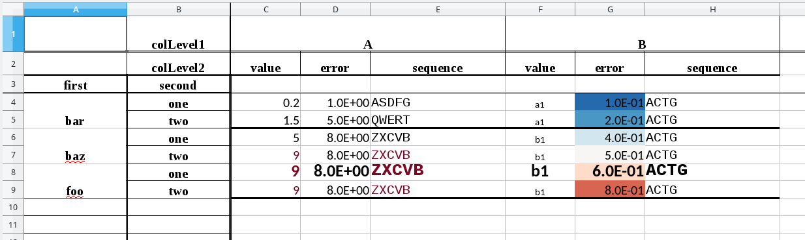

# XlsxPandasFormatter

Deals with the limitations of formatting when using Pandas dataframe and xlsxwriter to export to Excel format.

Provides a helper class that wraps the worksheet, workbook and dataframe objects written by pandas to_excel method using the xlsxwriter engine to allow consistent formatting of cells. A FormatedWorksheet is a helper class that wraps the worksheet, workbook and dataframe objects written by pandas to_excel method using the xlsxwriter engine. It takes care of keeping record of cells format and allows user to apply successively formats to columns, rows and cells. It also provides methods to format group of columns based on column name pattern, and apply special separations between groups of rows.

This class is a quick and dirty workaround to the limitations of formatting in xlsxwriter. It was inspired by the other package [XlsxFormatter](https://github.com/Yoyoyoyoyoyoyo/XlsxFormatter). The latter, however, cannot be used in the case of creating xlsxwriter Worksheet through the Pandas `to_excel` method.

## Notes

The FormatedWorksheet class does not handle hierarchical formatting, i.e. single cell formatting with higher priority than column formatting.


## Installation
```shell
pip3 install XlsxPandasFormatter
```

## Use case

The general use of the class is described in the following detailed example:

```python
from xlsxpandasformatter import FormattedWorksheet
import seaborn
import pandas as pd
import pandas.io.formats.excel

index = pd.MultiIndex.from_product([['bar', 'baz', 'foo'], ['one', 'two']], names=['first', 'second'])
columns = pd.MultiIndex.from_product([['A', 'B'], ['value', 'error', 'sequence']], names=['colLevel1', 'colLevel2'])

df = pd.DataFrame([[0.2, 1, 'ASDFG', 'a1', 0.1, 'ACTG'],
                   [1.5, 5, 'QWERT', 'a1', 0.2, 'ACTG'],
                   [5, 8, 'ZXCVB', 'b1', 0.4, 'ACTG'],
                   [9, 8, 'ZXCVB', 'b1', 0.5, 'ACTG'],
                   [9, 8, 'ZXCVB', 'b1', 0.6, 'ACTG'],
                   [9, 8, 'ZXCVB', 'b1', 0.8, 'ACTG']],
                  index=index,
                  columns=columns)

# In order to change the header format, we have to remove the default formatting of header by pandas
# See http://stackoverflow.com/questions/36694313/pandas-xlsxwriter-format-header
pandas.io.formats.excel.header_style = None

# Create a workbook using the Pandas writer with the xlsxwriter engine
writer = pd.ExcelWriter('test.xlsx', engine='xlsxwriter')
hasIndex = True
df.to_excel(writer, index=hasIndex, sheet_name='sheet1')
workbook = writer.book
worksheet = writer.sheets['sheet1']

# Wrap the worksheet, workbook and dataframe objects into a FormatedWorksheet object
# which will take care of keeping memory of cells format.
formattedWorksheet = FormattedWorksheet(worksheet, workbook, df, hasIndex=hasIndex)

### Examples of format methods

## Change header format
# Note that in order to change the header format, we have to remove the default formatting of header by pandas
# See above. Alternatively, one can use the default Pandas header format, which works well for multiindex dataframes.
formattedWorksheet.format_header(headerFormat={'font_name':'Times New Roman', 'align':'center', 'bold':True,
                                               'bottom':6, 'left':1, 'right':1}, rowHeight=[30, 20])

## Change index format
formattedWorksheet.format_index(indexFormat={'font_name':'Times New Roman', 'align':'center', 'bold':True,
                                             'right':6, 'bottom':1}, colWidth=15)

## Freeze index, header, or both index and header
# formattedWorksheet.freeze_header()
# formattedWorksheet.freeze_index()
formattedWorksheet.freeze_index_and_header()

## Apply format to column
# The column can be given either by integer location or by name
formattedWorksheet.format_col(('B', 'value'), colFormat={'font_size':8})
formattedWorksheet.format_col(3, colFormat={'align':'center'})

## Apply format to row
# The row can be given either by integer location or by name
formattedWorksheet.format_row(('foo', 'one'), rowFormat={'font_size':14})
formattedWorksheet.format_row(4, rowFormat={'bold':True})

## Apply format and column width to columns.
# The method format_cols accepts either of following arguments:
# colWidthList: list of column width, same length as the number of columns of dataframe.
# colFormatList: list of dictionary-like format, same length as the number of columns of dataframe.
# colPatternFormatList: list of tuples (pattern, format dictionary). The format will be applied
# to all columns that match the regex pattern at any of the column levels.
columnWidthList = [10, 10, 20, 10, 10, 20]
colPatternFormatList = [(r'[sS]eq', {'font_name':'Courier New'})]
formattedWorksheet.format_cols(colWidthList=columnWidthList,
                               colFormatList=None,
                               colPatternFormatList=colPatternFormatList)

## Apply numeric format to columns
numFormatScientific = '0.0E+00'
numFormatFloat2digits = 0x02
numFormatInteger = 0x01
# The colPatternFormatList is a list of tuples (pattern, numeric format), where
# numeric format is either an integer or a string as described here:
# http://xlsxwriter.readthedocs.io/format.html#set_num_format
# The format will be applied to all columns that match the regex pattern.
colPatternFormatList = [
    (r'error', numFormatScientific)
]
formattedWorksheet.format_numeric_cols(colPatternFormatList)

## Apply a colormap background color to column
colorMapRGB = seaborn.color_palette("RdBu_r", 61)
colormap = seaborn.blend_palette(colorMapRGB, as_cmap=True, input='rgb')
formattedWorksheet.format_background_colormap(('B', 'error'), colormap, vmin=0, vmax=1)

## Add a thick border line in between groups of row, as when using Pandas groupby method on column.
formattedWorksheet.format_add_separation_border_between_groups(('B', 'value'))

# Apply conditional formatting to dataframe rows in the same manner as
# Pandas apply method
def highlight_value_and_sequence_when_value_is_above_threshold(row):
  
    formatSeries = pd.Series(data=[dict() for _ in range(len(row))], index=row.index)

    if row[('A', 'value')] > 5:
        formatSeries.iloc[0]['font_color'] = '#7c0722'
        formatSeries.iloc[2]['font_color'] = '#7c0722'

    return formatSeries

formattedWorksheet.format_pandas_apply(highlight_value_and_sequence_when_value_is_above_threshold, axis=1)

## Finally, apply format dictionaries to all cells
# This has to be called just before the save() call. Any subsequent calls to xlsxwriter methods that modify
# the format of cells will override format from the FormattedWorksheet class.
formattedWorksheet.apply_format_table()

writer.save()

```

Output:

